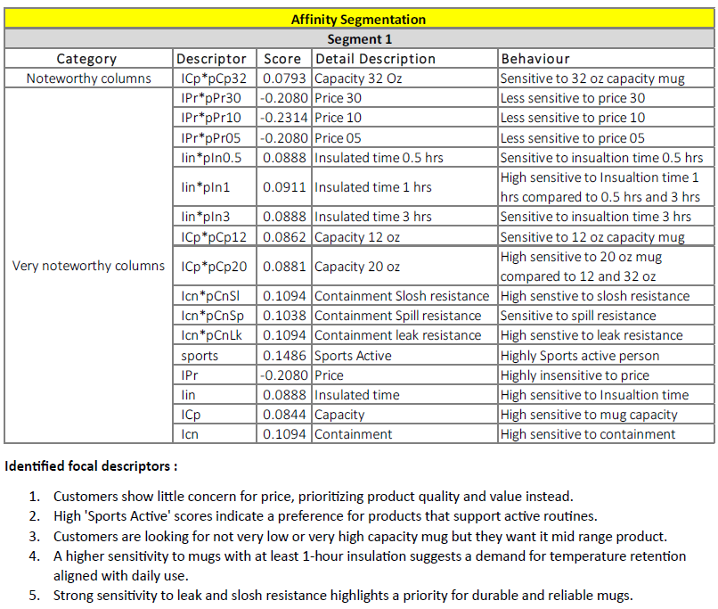
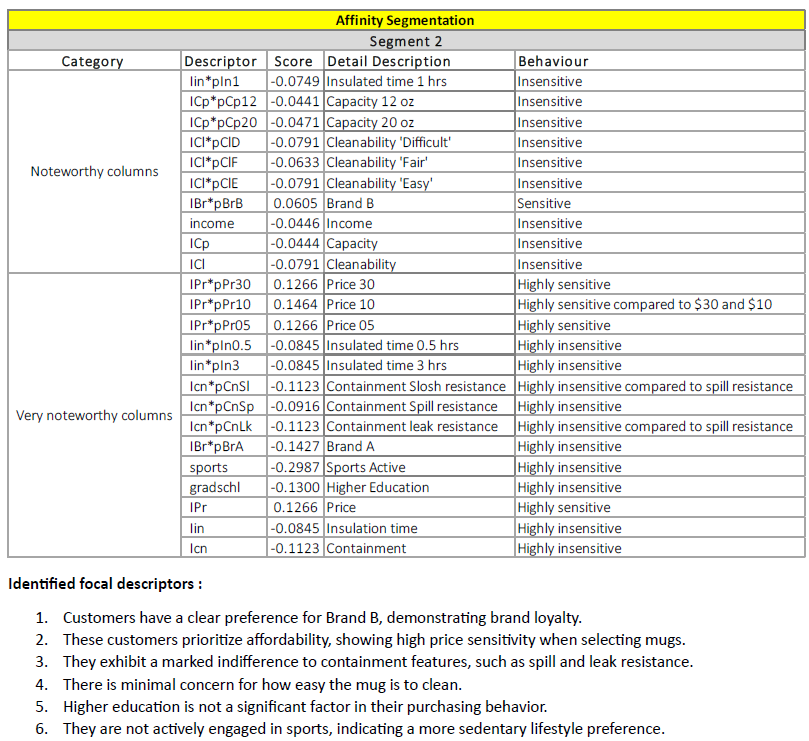
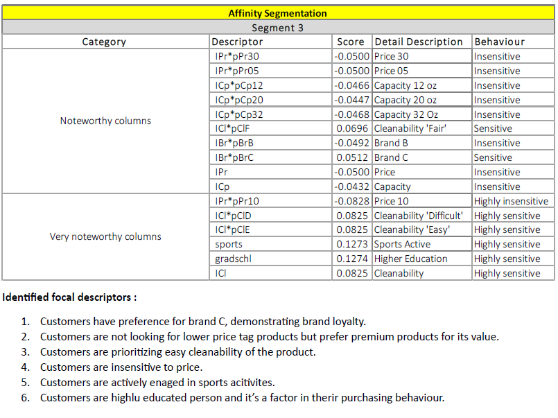
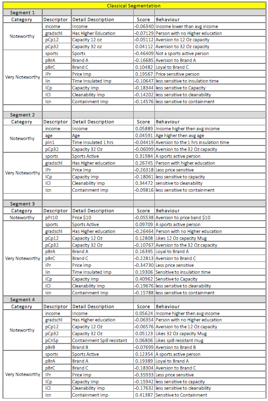

## Customer-Segmentation-using-Classical-and-Affinity-Based-Techniques

## Overview
This project explores customer segmentation using two approaches — Classical Clustering Techniques and Affinity-Based Market Basket Analysis — applied to retail transactional data. 
The objective is to uncover meaningful customer segments and product groupings to drive data-informed marketing and product strategies.

## Project Structure
**Part A - Affinity Segmentation**
Association rule mining and affinity analysis to find product combinations frequently bought together.

**Part B - Classical Segmentation**
Classical clustering techniques (KMeans, Hierarchical Clustering, DBSCAN) applied to transaction metrics like RFM (Recency, Frequency, Monetary).

## Techniques & Tools Used

- **Association Rule Mining**
  - Apriori Algorithm
  - Support, Confidence, Lift metrics

- **Clustering Algorithms**
  - K-Means
  - Hierarchical
  - DBSCAN

- **Dimensionality Reduction**
  - PCA for 2D visualization

- **Metrics**
  - Silhouette Score
  - Dendrograms

- **Libraries**
  - pandas
  - scikit-learn
  - mlxtend
  - matplotlib
  - seaborn
 
## Key Findings
**High-lift association rules revealed key product bundles and affinities in transactions.
Optimal clusters identified through elbow method and silhouette analysis.
Clear customer segments emerged based on purchasing behavior (e.g., high-frequency vs. low-monetary value buyers).**

## Screenshot for Solution Report 
  **Affinity Segmentation 1**
    

      
    

  **Affinity Segmentation 2**
    

      
    

  **Affinity Segmentation 3**
    

      
    

  **Classical Segmentation**
    

      
    

## Disclaimer
This project was developed as part of an academic assignment and is intended for educational purposes only. The data, methodology, and results should 
not be used for real-world business decisions without further validation and context-specific adjustments.
